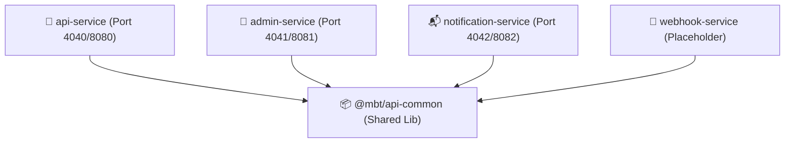

# KodPlayer Backend Monorepo

Welcome to the backend of **KodPlayer**, a high-performance, distributed video streaming platform designed to support multi-bitrate HTTP Live Streaming (HLS) transcoding and playback.

This repository is organized as a high-performance **Turbo monorepo** managed with `pnpm`. It decouples business logic across independent microservices, backed by a shared core utilities library.

---

## 🌟 Features

* **Monorepo Architecture**: Shared code management via `@mbt/api-common` workspace package.
* **Microservices Model**: Discrete NestJS services for public API, administration, and background notification tasks.
* **Adaptive HLS Transcoding Engine**: An automated background transcoding pipeline powered by `fluent-ffmpeg` and `ffprobe` that parses incoming raw MP4 uploads and packages them into multi-resolution HLS streams (360p, 720p, 1080p) complete with master playlists (`master.m3u8`).
* **Background Notification Processing**: Bulletproof queuing architecture using BullMQ and Redis to process push events and notifications reliably.
* **Session Management**: Secure cookie-based stateful authentication for both customer profiles and administrative dashboards.

---

## 🏗️ Repository Architecture



### 1. Packages
* **[@mbt/api-common](file:///Users/rajkumar/Desktop/kodplayer-backend/packages/api-common)**: Houses Mongoose ODM schemas (`User`, `Admin`, `Video`, `UserDevice`, `Notification`, etc.), health probes, custom exception filters, Google Cloud Storage integrations, and the global HTTP success envelope interceptor.

### 2. Services
* **[api-service](file:///Users/rajkumar/Desktop/kodplayer-backend/services/api-service)**: Exposes endpoints for public users. Handles customer profiles, OTP-based authentication, catalog exploration, and playback stats tracker (views count incrementer).
* **[admin-service](file:///Users/rajkumar/Desktop/kodplayer-backend/services/admin-service)**: Supports dashboard operations for content administrators. Includes raw MP4 uploads handling, transcoding task registry, and executes multi-bitrate HLS segmentation jobs under the hood.
* **[notification-service](file:///Users/rajkumar/Desktop/kodplayer-backend/services/notification-service)**: Consumes worker queues powered by Redis and BullMQ to register push notification devices and dispatch FCM alerts.
* **[webhook-service](file:///Users/rajkumar/Desktop/kodplayer-backend/services/webhook-service)**: Currently kept as a placeholder service for future extension of subscription webhooks and merchant checkouts.

---

## 🛠️ Prerequisites

Ensure you have the following installed on your host system:
* **Node.js** (v18 or higher)
* **pnpm** (v9 recommended)
* **MongoDB** (running locally or a connection URI string)
* **Redis** (required for background queues in `notification-service`)
* **FFmpeg & FFprobe** (installed and added to your system's PATH; required by the transcoding engine)

---

## 🚀 Quick Start (Development)

Follow these steps to launch the entire monorepo backend suite:

### 1. Install Dependencies
Run the following at the root of the monorepo:
```bash
pnpm install
```

### 2. Configure Environment Variables
Copy the root example configuration to a live `.env` file:
```bash
cp .env.example .env
```
Open `.env` and configure your Mongo URI, Redis URL, JWT Secrets, and GCS Bucket credentials.

### 3. Initialize Admin Account
Run the database migration and admin seeder to initialize the default administrator credentials:
```bash
# Apply migrations to MongoDB
pnpm run migrate:up

# Insert demo admin (Credentials: admin@kodplayer.com / Admin@123456)
pnpm run seed:admin
```

### 4. Boot Dev Servers
Fire up all services simultaneously using Turbo:
```bash
pnpm run dev
```

Alternatively, run specific services using target filters:
```bash
# Run Admin Service only
pnpm run dev:admin

# Run API Service only
pnpm run dev:api
```

---

## 🚀 Production Deployment (PM2)

For production deployment, PM2 is configured to manage processes and logs efficiently under `ecosystem.config.cjs`.

### 1. Compile Code to Javascript
```bash
pnpm run build
```

### 2. Start PM2 Daemons
```bash
pnpm run start:pm2:prod
```

### 3. Check Logs and Service Status
```bash
# View dashboard metrics
pnpm run status:pm2

# Tail combined logs
pnpm run logs:pm2
```
